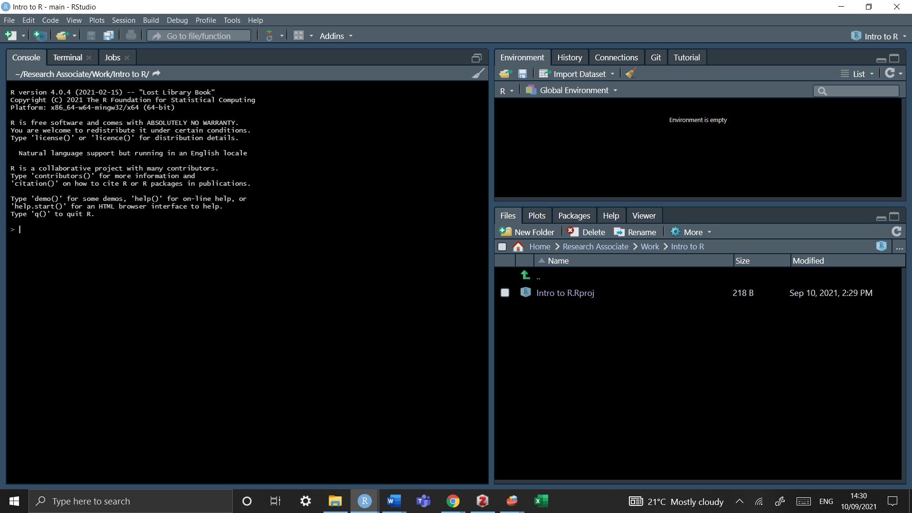
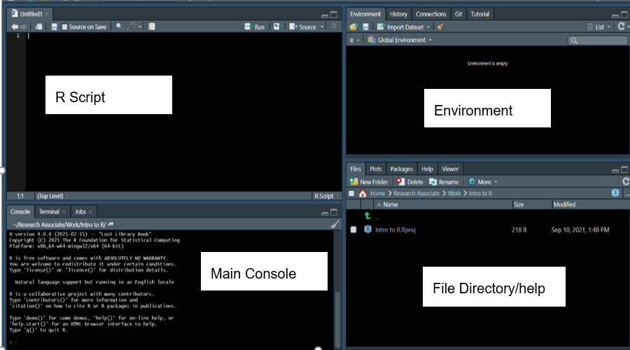

```{r setup, include=FALSE}
#knitr::opts_chunk$set(echo = TRUE)

library(png)
library(tinytex)
library(devtools)
library(foreign)
library(janitor)
library(haven)
library(Hmisc)

#import data from .sav to spss format
bsa <- read.spss("bsa_2017_open_enviropol.sav", to.data.frame = TRUE)  #foreign
class(bsa$Rsex)
levels(bsa$Rsex)

#bsa2 <- read_sav("bsa_2017_open_enviropol.sav")  #haven
#bsa3 <- read_spss("bsa_2017_open_enviropol.sav") #haven


```


\newpage


## 1. Introduction 

The aim of this guide is to provide an introduction to analysing large UK surveys using the statistical software R and its embedded packages. This document is targeted at two categories of users: 

1.	Those outside higher education, or who do not have access to one of the commonly used statistical packages such as Stata, SPSS or SAS (as R open sourced) but who would like to conduct their own analysis beyond what is usually published by data producers such as the Office for National Statistics (for example statistics for specific groups of the population).

2.	More advanced users who are already familiar with one of the aforementioned packages but would like to learn how to carry out their analyses in R. The guide, therefore, focuses on providing step-by-step examples of common operations most users carry out in the course of their research: how to open datasets, do basic data manipulation operations, produce simple descriptive statistics or weighted contingency tables. This is meant to provide the first category of users with a range of procedures that will help them produce straightforward and robust analyses tailored to their needs without spending too much time on learning the inner workings of R. The second category of users will find a number of familiar operations from which they will be able to further expand their R skills. 
It should be noted however that this guide is not an introduction to R. Beginners should use it in conjunction with one of the more comprehensive guides available online. Links and information about R resources are available at the end of this document.

Examples provided in this guide, use the British Social Attitude Survey (BSA, 2017), which can be downloaded from the UK Data Service website. The website also has instructions on how to acquire and download large-scale government datasets.


### 1.1 What is R and R Studio 

R is a free, user developed, advanced statistical and computing program. It has a large audience in the programming and statistical community and is increasingly used in the academic world for teaching purposes. R can be downloaded from the Comprehensive R Archive Network (CRAN) website. Installation instructions as well as guides, tutorials and FAQ are available on the same website. 

R is often described as an object-oriented statistical programming language rather than simply a statistical analysis package. It originates in the ‘S’ and ‘S Plus’ languages developed during the 1970s and 1980s. Anyone can download and use it without charge, and to some extent contribute to and amend the existing programs itself. It is particularly favored by users who want to develop their own statistical application or implement the latest advances that are not yet available in commercial packages. The existence of a vast number (more than 3,600 at the time of writing this guide) of user written packages – which bear some resemblance to down-loadable  files in Stata – is one of the great strengths of R. Users who want to contribute should be aware that in order to be part of the R archive, a minimum set of rules need to be followed.

Although R can perform most of the tasks available in generalist statistical packages such as Stata, SPSS, or SAS, it has a broader potential since it can also be used for mapping or data mining. Being a language also means that there are often several ways to carry out analyses in R, each one with its pros and cons.  Publication quality output from R can be obtained easily thanks to its integration with the LaTeX document presentation system, and R graphs can also be imported into MS Word documents.  


### 1.2 The Pros and Cons of R

Although R has advantages over other statistical analysis software, it has also a few downsides, both of which are summarised below. Users should be reminded that as an open-source software, R and its packages are developed by volunteers, which makes it a very flexible and dynamic project, but at the same time reliant on developers’ free time and good will.


```{r table2, echo=FALSE, message=FALSE, warnings=FALSE, results='asis'}

tab1 <- "

| Pros                                                                                    | Cons                                                                                    |
|-----------------------------------------------------------------------------------------|-----------------------------------------------------------------------------------------:|
|R is free, and allows users to perform almost any analysis they want. | The learning curve may be steep for users who do not have a reasonably robust background in statistics and programming. |
|  |   |
|R puts statistical analysis closer to the reach of individual citizens rather than specialists. | Problem solving (for both advanced and beginners) in R may be time-consuming, depending on how common the problem encountered is and may lead to more time spent solving technical rather than substantive issues. |
|   |  |
| Transparency of use and programming of the software and its routines, which improves the peer-reviewing and quality control of the software in many cases | Packages can stop being maintained without notice, and some of them have a short life span. Many people who design them are or will become busy academics, and at some point will not have the time to maintain them anymore. Others will take over in some, but not necessary in all the cases | 
|    |    |
| Very flexible |  |
|   | | 
|Availability of a wide range of advanced techniques not provided in mainstream statistical software or  only available in specialised packages |  |
|  | | 
| A very large user base provides abundant documentation, tutorials, and web pages |   |


"


cat(tab1)

```


## 2. R; essential information

The R installation programs can be downloaded from the CRAN website and run like any other Windows applications. Versions for Mac and Linux are also available.

Not sure if you want to include this section/add more to this section, maybe specific steps about installing, or to include more information about the differences between R and RStudio?


## 3. R Studio


There is a more user-friendly way of using R that is becoming increasingly popular among R users, which is R Studio. This software package is available to download from this website: https://www.rstudio.com/.

In R Studio, R syntax works exactly the same as with the traditional R environment, but the interface is more interactive, which makes it easier to use.


### 3.1 The R Studio Interface


Once you open R studio you will be directed to a screen with three main panels; 


```{r panels, echo=FALSE, out.width = '100%'}

image <-  

image
```


What we are working is an 'empty interface. An RStudio project is just a directory (a folder) with the name of the project, and a few files and folders created by R Studio for internal purposes.


Tip: 

If you want to change the aesthetics as seen above simply go to *tools* -> *global option* -> *appearance* and choose your desired aesthetic 


### 3.2 To create a new project and Working Directoy 

Go to *File* -> *New Project* -> *New Directory* -> *New Project* 

And then select a name and folder in which you want to save this. Now you have what is known as a working directory - any additionally data should be saved into this folder (but we'll cover this later)

if you don't want to create a project, maybe because you're working with smaller data you can simply set and check you working directory via 


```{r, eval= FALSE, echo= TRUE}

getwd()   #identifies which folder R uses by default to store and retrieve files 

setwd("C:Documents/username/mydocuents/BSA")   #set your working directory by choosing your desired location on your computer (the folder BSA would need to be created first)
```


Additionally, you set this manually though the graphical interface via 

*file* -> *change directory* 


Some notes: 

•	any character string that is neither a command nor the name of an object (such as a variable name) needs to be put between inverted commas or quotation marks - see the example below about setting your working directory.
•	even when no parameters are specified for a command, brackets are compulsory as shown in the getwd () example above
•	R uses forward slashes (/) rather than backslashes (unlike most Windows applications) to separate directories. Using backlashes will return an error message
•	although in theory most R commands require a large number of options to be specified, in many cases default values have been ‘factory set’ so that only the essential parameters need specifying.


### 3.3 In order to create a script 

There are three methods to creare a new script;

• *File* ->  *New File* ->  *New script* 
• Press the ‘Plus’ green button
• Cltr + Shift + N


```{r, echo=FALSE, out.width = '100%'}

image <-  

image
```


Now we are introduced to four panels 
1. the script is where you code is written (top left)
2. the main console produces the results from the script (bottom left)
3. the environment saves any dataframes or objects that are being used (top right) 
4. the file directory are where all packages are saved under CRAN, there is also a help menu (bottom right) 


Practice talking to your computer; in the script type "My name is (your name), run the code by pressing CTRL+R (or at the top of the panel click "Run") and you will see this code in your main console - this is how R communicates!


```{r, eval= TRUE, echo=TRUE}
print("My name is x")

```


### 3.4 Installng and Loading Packages 


Apart from a basic set of commands and functions, most of the tools offered by R are available in packages that are not provided during the main installation and need to be installed and downloaded separately from within R. For example, in order to install the foreign package which allows users to import Stata or SPSS datasets, one needs to type the following code to download packages into R


```{r, eval=FALSE, echo=TRUE}
install.packages("forigen")

```


In order to then use the packages they have to be LOADED via the *library* function 


```{r, eval=FALSE, echo=TRUE}
library(foreign)

```


Every time you restart up R you will have to load packages again but once a package is installed it will be permanently stay in your file directory, unless deleted using this command (but this is not advised).


```{r, eval=FALSE, echo=TRUE}
remove.packages("foreign")

```


### 3.5 Getting help 

The standard help system in R (unless otherwise chosen at the time of installation) relies on the default web browser (Firefox or Internet Explorer in most cases) to display pages. Within R, the most straightforward way to request help with a command consists of a question mark followed by the command name, without a space in between.


Typing  *?getwd* is the equivalent of *help('getwd')* and will open the help page for the getwd() command in the default web browser. 

```{r, eval=FALSE, echo = TRUE}
?getwd

help('getwd')
```


This will work for any command directly available in memory (i.e in the default package or those in the packages loaded via the library()) command. Otherwise, R will return an error message.

Typing two question marks followed by a keyword will search all of R the available documentation for that keyword


```{r, eval=FALSE, echo = TRUE}
??foreign
```


An index of all commands and functions in the foreign package can be obtained by typing:

```{r, eval=FALSE, echo = TRUE}
help(package='foreign')

```


This only work because the ‘foreign’ package was previously loaded in memory with the library() command.

More information about where to find help when using R is provided at the end of this document.


### 3.6 Objects


An object is a dataframe that can be created and will exist in your global environment. To create an object you use the assignment operator which is just an arrow (<-). For example


```{r, eval=FALSE, echo=TRUE}
x <- 5 
```


In this example we've assigned the value 5 to an object call x - can you see it in your environment to the right. Run just 'x' and you will the value appear in your console 


```{r, eval=FALSE, echo=TRUE}
x

## [1] 5

```


#### Deleting objects in R 

To delte an object you use the rm() function 


```{r, eval=FALSE, echo=TRUE}
rm(x)
```

Now its removed from your global environment!


#### Saving objects and more in R 


When working with data, it is very likely that the user will edit the original dataset, either by recoding variables or creating new ones, etc. In those cases, saving the progress made in the data used is crucial to avoid repeating every single operation in the next session working with the data. 
There are several ways of accomplish this, depending on the format in which the data will be stored. 
The line of command used to save the data frame used called “mydata” is:


```{r, eval=FALSE, echo=TRUE}
save(mydata, file="mydata.Rda")
```


This command will save the data into a format that can be read by R. The first part of the command is referring to the data frame used in the current R session, while the section file="mydata.Rda", is referring to the data that will be saved in the working directory. The name of the saved file can be changed, for instance:


```{r, eval=FALSE, echo=TRUE}
save(mydata, file="mydata_Jan17.Rda")
```


To load the saved .Rda data: 

```{r, eval=FALSE, echo=TRUE}
load("mydata_Jan17.Rda")
```


This command will work only if the working directory where the data is stored is defined in advance. Alternatively, the path to the folder where the data is saved can be specified.


```{r, eval=FALSE, echo=TRUE}
load("c:/mydocuments/mydata_Jan17.Rda")
```


Another option to save the data is using the “foreign” package, so data can be exported to several formats, such as .txt, .cvs, .dta, which can be used in other software packages.
The following example shows how to export data from R to a comma delimited format (.csv) that can be read in excel, Stata and SPSS.


```{r, eval=FALSE, echo=TRUE}
library(foreign)
write.csv(mydata, “mydata.csv”, row.names=FALSE) 
```


Another example is to export the data as a Stata file, using the foreign package previously loaded:


```{r, eval=FALSE, echo=TRUE}
write.dta(mydata, "mydata.dta") 
```


The newly created files will be stored in the working directory defined earlier on. 

Some users will want to save the whole R project in which they are working. This would include functions, variables, data (in R it is possible to load and work with more than one dataset at a time). This option comes very handy, especially when working with several datasets.

Thus, another approach is to save the current session or workspace as an image, using the save.image command, specifying the path where the workspace will be saved. For example, to save ‘my current session’ in R, one needs to write the following command, making sure to include the .RData extension.


```{r, eval=FALSE, echo=TRUE}
save.image("c:/Folder/my_current_session.RData")
```


This will open a window to save the workspace in a particular folder, which can be different from the current working directory. The name needs to be specified in the ‘File name’ section. The workspace will be saved in the chosen folder as an .RData file. 


The data can be retrieved using the load function


```{r, eval=FALSE, echo=TRUE}
load("c:/Folder/my_current_session.RData")
```


Or using graphical interface as follows:

*File* -> *load workspace*


## 4.  Opening UK dataservice in R 


In this guide, we use the BSA 2017 survey, which can be downloaded from the UK Data Service website. The website also has instructions on how to acquire and download large-scale government datasets.

Save this into the same project folder.


### 4.1 Which versions of the UKDS can I use in R


Pay attention to what type of file you have downloaded (whether csv, spss or stata) as this will affect how you import data into R

If you have saved the download file into the same project folder you won't have to specify the full path line 


```{r, eval=FALSE, echo=TRUE}

bsa <- read.dta("bsa.dta")                          #dataframe 
bsa <- read.spss("bsa.sav", to.data.frame = TRUE)   #spss file 
bas <- read.csv(("bsa.csv"))                        #cvs file


```


In R jargon, we have loaded the content of the BSA file into an R object which is called a ‘data frame’. By contrast with Stata and SPSS, R allows users to open several datasets simultaneously, so we could for example load another issue of the BSA into the memory. The number of datasets that may be opened simultaneously is only limited by the computers physical memory. R uses by default all the memory available on your computer if necessary. This means however that the program can become slow if you open a very large dataset on a computer 

Note: The foreign package can only read Stata files up to version 12 . To import data from Stata version 13 and above, the data need to be saved in Stata 12 version. The Stata command save old is useful for this.

To save the file ‘example_v13.dta’ (already loaded in Stata) in Stata 12 version, use the following command:


```{r, eval = FALSE, echo=TRUE}
saveold example_v13, version(12)
```


The data will be saved in a version compatible with the ‘foreign’ package of R, so it can be imported into R using the ‘read.dta’ function.

There are other alternatives to import data from Stata (up to version 14), SAS and SPSS. This is the newly created package called ‘haven’  by Hadley Wickham and Evan Miller.


### 4.2 Understand the dataset


The *View* function returns the whole dataset (notice the capitcal V - R is case sensitive which means if you run *view* you will receive and error saying "could not find function view")

```{r, eval=FALSE, echo=TRUE}
View(bsa)
```


How many observations and variables are there in the dataset

```{r, eval=TRUE, echo=TRUE}
dim(bsa)
```

There are 3988 observations and 29 variables


How to explore one variable?

```{r, eval=FALSE, echo=TRUE}
bsa$Rsex
```


This produces the first 100 observations which can be messy to read. The summary functions summaries the type of variable and how may observations there are. 


```{r, eval=FALSE, echo=TRUE}
summary(bsa$Rsex)
```

Now we can see that there are 1806 Males and 2182 Females in our dataset 


In order to vie the first 6 rows of the dataset, the 'head' function can be used

```{r, eval=FALSE, echo=TRUE}
head(bsa)
```


Since an R session may involve several datasets at the same time, having variable names immediately recognized when typed requires that we ‘attach’ a dataset as the default data frame.


```{r, eval=FALSE, echo=TRUE}
attach(bsa)
```


We can now omit the dollar sign prefix when specifying a variable in our analyses.

Despite the practicalities of the attach/detach command, it is always advised to use this code with caution, since the risk of confusion is greater, especially when working with several datasets at a time and when the same variable names are used in different datasets. Many online references can be found advising about whether to use or not the attach function. For instance, on the UCLA website , there is a brief explanation of the main issues.


*This guide will not be using this package*  - this is actually up to you Sarah, here's an example how different the output can look with and without the package


#using attach 

```{r, eval=TRUE, echo=TRUE}
bsa$Married[6]

#out put will look like this;

#[1] Never married
#4 Levels: Married/living as married Separated/divorced ... Never married

#You'd also have to know the column number of each variable (6), with this example as well they are actually long variable names so they don't appear correctly

```


#not using attach 

```{r, eval=TRUE, echo=TRUE}
levels(bsa$Married)

#output without

#[1] "Married/living as married" "Separated/divorced"       
#[3] "Widowed"                   "Never married"    

```


### 4.3 Identifying and selecting variables 

As we have already seen, variables are objects. R automatically stores variables using the appropriate object class. Categorical variables are ‘Factors’ with ‘Levels’ as categories within these, while continuous variables are ‘Numeric’ types of object.

If one is unsure about which class an object belongs to, one can use the class() command in order to find out by typing *class(dataset$variable)*


```{r, eval=TRUE, echo=TRUE}
class(bsa$Rsex)
```


The variable Rsex is marked as a 'factor' which translates to mean a categorical variable. To see what levels are within the variable we can use 'levels()


```{r, eval=TRUE, echo=TRUE}
levels(bsa$Rsex)

#[1] "Male"   "Female"
```


*important information* depending on how you read in the dataset, you may receive different outputs when using the 'class' function. For example if you used read_sav or read_spss then this variable will be marked as 'haven_labelled' 

```{r, eval=FALSE, echo=TRUE}
bsa2 <- read_sav("bsa_2017_open_enviropol.sav")
bsa3 <- read_spss("bsa_2017_open_enviropol.sav")

class(bsa2$Rsex)
class(bsa3$Rsex)
```


In R, character variables need to be marked as 'factors' Use the as.factor to convert numeric and haven labels into categorical varaibles


```{r, eval=FALSE, echo=TRUE}
bsa2$Rsex <- as.factor(bsa2$Rsex)   #convert
class(bsa2$Rsex)                    #check the level
```

Now we have a factor which R recognises as categorical with varying levels 


What about a continuous variable?  

The variable 'leftright' is marked as a 'factor' which is strange because this is actually a numeric variable ranking people political opinion on a scale from left to right 


```{r, eval=TRUE, echo=TRUE}
class(bsa$leftrigh)

#[1] "factor"
```


So why has R is telling us this is a factor - well this is the issues with R, it doesn't understand the metadata and how these variables were collected for the survey - it's always important to check you levels of measurement with your datasets!

We will show you how to recode this variable into a 'numeric' in the next section!


Data frames consist of rows and columns, in the same way as Stata or SPSS datasets. Each row and column can be identified by its number between square brackets:

```{r, eval=TRUE, echo=TRUE}
bsa[6,4]
```

we will get the value of the 8th observation (row) of the 4th column in the data. Which happens to be the variable 'Married' - in this instance this surveyor has never been married


To get a summary of a variable use; 

```{r, eval = TRUE, echo = TRUE}
summary(bsa$Rsex) 
```


On a categorical variable this will return the levels (same as the levels() function). For a continuous variable this will return mean, median and interquartile ranges  


## 5. Essentials of Data Manipulation 

Before attempting to produce statistical analyses in R we need to learn how to recode variables and deal with missing data.


### 5.1 Recoding numerical variables 


```{r, eval = FALSE, echo = TRUE}

bsa$leftrigh_log <- log(bsa$leftrigh)

```

Oh you recieve an error *Error in Math.factor(bsa$leftrigh) : ‘log’ not meaningful for factors* - Not to fear, R doesn't always know what variables you have and what they mean. The variable *leftright* is a numeric variable measuring the someones score on the left-right political scale. In survey data it is always important to check the metadata of your dataset which will tell you what type of variabls you have. 


We can simply covert this into a numeric variable and then run the code again


```{r, eval = FALSE, echo = TRUE}

bsa$leftrigh <- as.numeric(bsa$leftrigh)  #covert to numeric 
class(bsa$leftrigh)                       #check to see if it is numeric

bsa$leftrigh_log <- log(bsa$leftrigh)     #create new log of the leftright variable 

```


### 5.3 Renaming categorical variables 

In the case of categorical variables, we need to keep in mind that the possible values of the variables are what the summary() or the levels() commands returned – i.e actual names: these are not  numeric values to which value labels are added as with other programmes:  

In the variable 'Married' which identifies someones status of marriage.


```{r, eval = TRUE, echo= TRUE}
levels(bsa$Married) 

#[1] Married/living as married        Separated/divorced 
#[3]                 Widowed             Never married 
                  
```

*remember to convert to a factor if your variable is marked as 'haven_label'*


```{r, eval = TRUE, echo= TRUE}
bsa$Married <- as.factor(bsa$Married)             
```


We want to create a new variable that recodes 'separated/divorced'(2) and 'Never married' (4) and into a new variable called 'Not Married'

Its always advised to create new variables when recoding old ones so the original data is not tampered with, in this instance we have named this 'Married2. 


```{r, eval = TRUE, echo= TRUE}
bsa$Married2 <- bsa$Married     #Create a new variable that copies the original level 
levels(bsa$Married2)            #check the levels are the same 

levels(bsa$Married2) <- c("Married/living as married", "Not Married", "Widowed", "Not Married")   

levels(bsa$Married2)
```


So the second and fourth variables have been renamed to 'Not Married' as this is where the original levels were listed. Now we have three levels 

- Married/living as married 
- Not Married 
- Widowed


### 5.4 Misisng Values


We first created a copy of the bsa data, so we will keep an intact copy of the original dataset. If you check the ‘Environment’ section of your R Studio screen, you will see two datasets loaded: lfs and lfs_copy


```{r, eval=TRUE, echo= TRUE}
bsa_copy <- bsa
```

In R, missing values are presented as NA.  

Handling missing values in R is a bit more complex that in other packages as by default there are fewer safety nets than in other packages, for instance to tell users how many observations with missing values have been dropped in a variable. In addition, some commands can return error messages when dealing with variables whose missing values have been recoded to NA since they will not necessarily have the same number of ‘rows’.


#### 5.4.1 check for total of NAs

To check sums across a specific variable or a whole dataset  

*sum(is.na(dataset$variable))*

```{r, eval=FALSE, echo=TRUE}

sum(is.na(bsa_copy))               #in the whole dataset
#[1] 35763

sum(is.na(bsa_copy$leftrigh))      #in the leftright variable 
#[1] 782 

mean(is.na(bsa_copy$leftrigh))     #returns the proportion of NAs

is.na(bsa_copy$leftrigh)           #returns true or false values 


```


#### 5.4.2 Recoding missing values as NA (continous)
 

```{r, eval = FALSE, echo= TRUE}

dataset$new_variable <- dataset$old_variable           #duplicate variable 
dataset$new_varaible[dataset$old_variable < 0] <- NA   #convert all 0s to NA

```


#### 5.4.3 Recoding mising values as NA (categorical)

If you had responses such as 'does not apply' or 'no answer' you can recode them to represent NA

 
```{r, eval = FALSE, echo= TRUE}
dataset$new_variable <- dataset$old_variable 
dataset$new_variable[dataset$new_variable == "Does not apply" |
                     dataset$new_variable == "No Answer"] <- NA
```


#### 5.4.4 Deleting NAs

To remove NA's from one variable (na.omit)

```{r, eval = FALSE, echo=TRUE}
bsa_copy$Rsex <- na.omit(bsa_copy$Rsex)

```


To return vector of rows with NA values (complete.cases)

This allows you to better review your NA. The na.omit() function relies on the  assumption that the dropped na rows (removed the na values) are similar to the typical member of the dataset, and are not total outliers.

Use complete.cases to produce a logical vector that indicates complete and missing values (in your rows) using TRUE or FALSE. 

```{r, eval = FALSE, echo=TRUE}

complete.cases(bsa_copy)

```

You can use a 'listwise deletion' to keep only those TRUE values


```{r, eval = FALSE, echo=TRUE}

complete_bsa <- bsa_copy[complete.cases(bsa_copy), ]

```


As you can see in your global environment, the dataset 'complete_cases' returns 0 observations - this is because every row has at least one NA. Use the sum function to get exact values 


```{r, eval = FALSE, echo=TRUE}
sum(complete.cases(bsa_copy))
```


Therefore you can use complete.cases to remove NAs from a column instead. For example you can remove all NAs from the variable 'eq_inc_quintiles' which represents the quantile of equivalised incomce 


```{r, eval = FALSE, echo=TRUE}
sum(is.na(bsa$eq_inc_quintiles))  #sum = 1990
removed <- bsa_copy$eq_inc_quintiles[complete.cases(bsa_copy$eq_inc_quintiles)]

# Or you can remove NAs from multiple columns at once 
removed <- bsa_copy[complete.cases(bsa_copy[, 5:7]),]  

```


## 6. Descriptive staistics - CONTINUOUS 


In this section, we will review a few typical analyses that beginners may be interested in: producing uni- and bivariate statistics with either continuous or categorical variables.

Producing descriptive statistics in R is easy, some of the functions come ready to use without any additional package needed. We have already seen above that the summary() command provides essential information about a variable. For instance,


```{r, eval = TRUE, echo= TRUE}
summary(bsa$leftrigh)
```

will give information about the mean, median and quartiles of the hourly earnings of respondents.


```{r, eval = TRUE, echo= TRUE}
summary(bsa$leftrigh, na.rm = T)
```


The describe() command in the Hmisc package provides a more detailed set of summary statistics. We need to install and load Hmisc first

```{r, eval = FALSE, echo=TRUE}
install.packages("Hmisc")
library(Hmisc)
```

Then 

```{r, eval= TRUE, echo=TRUE}
describe(bsa$leftrigh)
```

describe() also gives the number of observation (including missing and unique observations), deciles as well as the four largest and smallest values.

In addition to this, commands producing specific statistics are also available:

```{r, eval = TRUE, echo = TRUE}
mean(bsa$leftrigh, na.rm = T)
```

The added na.rm = T (or na.rm = TRUE) option prevents missing values from being taken into account (in which case the output would have been NA). Other similar commands that compute individual statistics are available by default , such as sd(), max(), min().

Using these individual commands may come in handy, for instance when further processing of the result is needed:


```{r, eval = FALSE, echo = TRUE}
m <- mean(bsa$leftrigh, na.rm= T)
rm <- round(m,2)
rm

## can be created in one line like so 

round(mean(bsa$leftrigh,na.rm=T),2)

```


### 6.1 Distribution graphs 

There are really easy functions part of R's base packages that allow for you to produce quick visalusations. The below code highlights how to produce different types of graphs for the continuous variable 'leftright' which represents someones score on the political scale. The graphs will be visible in the ‘Plot’ tab in the lower right side of the R Studio window. You can see it in another screen by clicking on ‘zoom’. There are other options available for the plots; you are free to explore them on your own.

Custom titles, notes and legends as well as colours, can be added to a R plot. See ?hist for more details. 


```{r, eval=TRUE, echo=FALSE}
bsa$leftrigh <- as.numeric(bsa$leftrigh)
bsa$libauth <- as.numeric(bsa$libauth)
```


#### Base Packages 

```{r, eval = TRUE, echo = TRUE}

hist(bsa$leftrigh)
boxplot(bsa$leftrigh)
plot(bsa$leftrigh)

library(help = "graphics")  #help for base package
?hist                       #help for function
```


### 6.2 Siginifcance of correlation 

R also offers a wide range of bivariate statistics by default. In the same fashion as mean() above, corr(), cov() var()provide basic measures of association.

Here we are correlating the leftright scale and the libertarian-authoritarian  scale 

```{r, eval=TRUE, echo=TRUE}
cor(bsa$leftrigh, bsa$libauth, use='complete.obs')
```

Note: cor() and cov() allows users to choose the method used for computing the correlation (between Kendall, Spearman, and Pearson) which enable running it on non-normally distributed variables (for example on ordinal variables). 

Note: cor() and cov() (but not var()) return an error when na.rm is specified, instead of use=''. Users will need to refer to the documentation  (by typing ?cor ) for additional information.


We can perform a T test on the values returned by  cor() with the cor.test(). cor.test()will also return a confidence interval:


```{r, eval=TRUE, echo=TRUE}

cor.test(bsa$leftrigh, bsa$libauth, use='complete.obs')
```


### 6.3 Table of summary statistics 

We may want to go a bit further and produce a table of summary statistics, that is to inspect the distribution of a variable for (a) given subpopulation(s) or across the categories of another variable, for which we will need the command summaryBy() in the package doBy.

```{r, eval= TRUE, echo = TRUE}
library(doBy)

```


```{r, eval = TRUE, echo=TRUE}
summaryBy(leftrigh ~ Married2, data = bsa, FUN = mean, na.rm = TRUE)
```


Notes:

The first parameter which specifies the continuous and categorical variable delimited by a tilde (~) is called a ‘formula’ in R jargon and is used by several other commands (such as contingency tables or regression analysis).

•	In the case of summaryBy(), the second term of the formula is always the categorical variable, and there can be more than one specified, in which case the mean will be computed for each combined categories of the variables to the right of the tilde.
•	The ‘FUN’ term can consist of several statistics, in which case they must be combined using the c() command.
•	The source of the data needs to be mentioned explicitly whether or not a data frame has been previously attached as the default one.


```{r, eval=FALSE, echo = TRUE}
summaryBy(leftrigh ~ Married2 + Rsex, data = bsa, FUN = mean, na.rm = TRUE)


```


### 6.4 Bar charts and plots of summary statistics 

As with any other R command, we can store the output of summaryBy() into an object. In this case, the default class is a data frame, with the same properties as the ones described above. The advantage of having results stored in a data frame is that it can be easily used with one of R graphical commands. These graphs can be saved as files which can in turn be imported in Word documents.

Let us begin with a simplified version of the summary table shown above and store it in a data frame called g:


```{r, eval= TRUE, echo = TRUE}
g <- summaryBy(leftrigh ~ Married2, data = bsa, FUN = mean, na.rm = TRUE)
```


There are several plots commands that we can use to plot these data: barplot() is the most common and works out of the box with simple plots (for instance if we only had one categorical variable in the data):


```{r, eval = TRUE, echo = TRUE}

barplot(g$leftrigh.mean, names.arg = g$Married2)
```


The first parameter specified the variable to be plotted, the second one the labels or categories for each one of the means that are plotted. In both case, the data frame to which the values belong needs to be specified. 
This initial plot is not fully satisfactory: the names of the regions are not displayed properly. Using a horizontal bar plot and adjusting the margins of the window would give a better result:


```{r, eval = TRUE, echo = TRUE}

barplot(g$leftrigh.mean, names.arg = g$Married2, col = 'blue', las =1)


```


This graph still looks a bit rudimentary. 


#### ggplot2


The ggplot() function in the ggplot2 library will give a better output of publication quality. It is however more complex to use.

First, let us go back to our initial two way table of political scale by gender and marriage status:


```{r,eval= TRUE, echo= TRUE}
library(ggplot2)

g2 <-summaryBy(leftrigh ~ Married2 + Rsex, data = bsa, FUN = mean, na.rm = TRUE)

ggplot(g2, aes(Married2, leftrigh.mean, fill=Rsex)) + 
geom_bar(stat='identity', position = 'dodge') + 
coord_flip() + xlab('Marriage Status') + 
ylab('Mean Political Scale')

```


Note: Unlike Stata, R does not assume that commands end with lines. It will continue reading the script file until it finds the characters that are supposed to complete it: in many cases, the closing bracket ‘)’.

Unfortunately, the syntax of ggplot2 does not fully respect the convention of most other R commands. Each parameter is specified by adding a ’+’, followed by the parameter name and its own options between brackets:

The first parameter is the name of the data frame from which the graph is to be drawn;
•	aes() or aesthetic specifies the first two variables to be plotted as ‘x’ and ‘y’, whereas the third one is specified as ‘fill’ variable;
•	geom_bar() specifies the appearance of the bars, for example whether stacked or not. Stacked is the default option; here we used ‘dodge’, which allows putting the categories of the ‘fill’ variable side by side;
•	coord_flip() specifies the orientation of the graph (ie horizontal )
•	xlab and ylab are the title of the x and y axis, respectively

ggplot offers many possibilities and it is recommended that users interested should consult the documentation on its website.


Other ggplot commands: 

Histograms: 

```{r, eval= TRUE, echo= TRUE}
ggplot(bsa, aes(x = leftrigh)) +
  geom_histogram(binwidth = 1) 

```


You can also had the 'facet_grid' command to higlight the ditribution of a continous variable over a categorical


```{r, eval= TRUE, echo= TRUE}
ggplot(bsa, aes(x = leftrigh)) +
  geom_histogram(binwidth = 1) +
  facet_grid(Rsex ~ .) 
```


How about adding some color and changing the appearance

```{r, eval= TRUE, echo= TRUE}
ggplot(bsa, aes(x = leftrigh, fill = Rsex)) +
  geom_histogram(binwidth = 1) +
  facet_grid(Rsex ~ .) +
  theme(legend.position = "none")
```


Instead of facets you could overlay the data with a bit of transparancy 

```{r,eval= TRUE, echo= TRUE}
ggplot(bsa, aes(x = leftrigh, fill = Rsex)) +
  geom_histogram(position = "identity", alpha = 0.3) 
```


Boxplots:

```{r, eval= TRUE, echo= TRUE}
ggplot(bsa, aes(x = 1, y = leftrigh)) + 
  geom_boxplot() +
  scale_x_continuous(breaks = NULL) + #removes the tick markers from the x axis
  theme(axis.title.x = element_blank())
```


The distribution of leftright over education

```{r, eval= TRUE, echo= TRUE}
bsa$HEdQual3 <- as.factor(bsa$HEdQual3)
ggplot(bsa, aes(x = HEdQual3, y=leftrigh)) +
  geom_boxplot()
```


Now lets order these along the X axis, remove the NAs and add an aesthetic. Make sure the dplyr package is instaleld and loaded for the filter function. 


```{r, eval= TRUE, echo= TRUE}
library(dplyr)
ggplot(filter(bsa, !is.na(HEdQual3) & !is.na(leftrigh)), 
       aes(x = reorder(HEdQual3, leftrigh, FUN = median), y = leftrigh)) +
        geom_boxplot() +
        theme_bw()

```


### 6.6 Saving and importing a graph in a word document 

Any R graph can be saved as an image file that can be subsequently imported in a Word or Latex document, for example. In this example, we will create a PNG image with the graph we have just created using the ‘ggsave’ option. By default, ggsave saves the last plot created, so we can simply write the following command, specifying the name of the plot (g2) and the format in which we want the graph. In this case, we will select ‘png’, but it can be other formats, such as: ‘.pdf’, ‘.jpg’, etc.:


```{r, eval= FALSE, echo= TRUE}
ggsave("g2.png")
ggsave("g2.pdf")
```


We can also store the plot in R and then save the specific plot that we need. This is useful when we have several plots and we want some of them in a format that can be exported. With ggsave we can also specify the dimensions of our graph and the units of preference.

Here we save the plot in our R console under the name of ‘g2plot’

```{r, eval= FALSE, echo= TRUE}
g2_plot <- ggplot(g2, aes(Married2, leftrigh.mean, fill=Rsex)) + 
geom_bar(stat='identity', position = 'dodge') + 
coord_flip() + xlab('Marriage Status') + 
ylab('Mean Political Scale')

```


Now we are saving (exporting) the plot into our working directory. The first argument, ‘g2plot.png’ corresponds to the name and format we are giving to our plot, the second argument is referring to the stored plot (in the R environment) that we want to save, and the others arguments indicate the dimensions and units of our png file. 


```{r, eval= FALSE, echo= TRUE}
ggsave(‘g2plot.png’, g2plot, 
       width = 15, height = 20, units = "cm")

```


A more general approach to save any type of plot (without using ggsave) is the following, where the first line of command creates the file, the second one ‘fills’ it with a graph, and the third one, closes it.


```{r, eval= FALSE, echo= TRUE}
png('g2plot2.png')

ggplot(g2, aes(Married2, leftrigh.mean, fill=Rsex)) + 
geom_bar(stat='identity', position = 'dodge') + 
coord_flip() + xlab('Marriage Status') + 
ylab('Mean Political Scale')


```


### 6.6 wighted descriptives 


The dataset used in this module consists of an individual-level weight named
,'WtFactor'   which takes into consideration the unequal selection probabilities and non-response of the survey.  


To link the bsa dataset to the weights;

```{r, eval = TRUE, echo = TRUE}
library(survey)

weighted_data <- svydesign(data = bsa, 
                           id = ~1, 
                           nest = TRUE, 
                           weights = bsa$WtFactor)


```


The basic functions from the survey package


```{r, eval = FALSE, echo=TRUE}
svytable(~Married, weighted_data) # for weighted frequency table (categorical)

svytable(~Married + Politics, weighted_data) # for weighted contingency tables (categorical)

svymean(~leftrigh, weighted_data, na.rm=TRUE) # for weighted mean and Standard error (continous)

svyquantile(~leftrigh, weighted_data, quantile=c(0.25, 0.5, 0.75), ci=TRUE, na.rm=TRUE) # for weighted quantile (continous)


```


To calculate weighted proportions simply add prop.table before

```{r, eval = FALSE, echo=TRUE}
prop.table(svytable(~ Married + Politics, weighted_data),1)   #row %
prop.table(svytable(~ Married + Politics, weighted_data),2)   #column %
```


To obtain the percentages


```{r, eval = FALSE, echo=TRUE}
round(prop.table(svytable(~ Married + Politics, weighted_data),1),3)  #row %
round(prop.table(svytable(~ Married + Politics, weighted_data),2),3)  #column%
```


The first number indicates the row or column %
The second number indicates what decile place you ar rounding to 


### Visualsing weghted data 

we can use the base package in R to make historgrams and boxplots:


```{r, eval = TRUE, echo = TRUE}
svyhist(~leftrigh,           
        weighted_data, 
        main="left/right political scale - weighted data", 
        freq = TRUE,
        col="lightblue",
        breaks = 30)

```


```{r, eval = TRUE, echo = TRUE}
svyboxplot(leftrigh ~1,           
        weighted_data, 
        main="left/right political scale - weighted data", 
        freq = TRUE,
        col="lightblue",
        breaks = 30)
```


## 7. Categorical Variables - contigency tables 

As with continuous variables, R offers several tools that can be used to create contingency tables assess their statistical significance and graph the results.

### 7.1 One way frequncy table

The simplest R command that we can use is table() which returns the number of observations within each level of a factor:


```{r, eval = TRUE, echo = TRUE}
a <- table(bsa_copy$Politics)
a

```

By itself, table() does not compute proportions nor percentages. These have to be specified manually using prop.table(). The following computes the percentages for the above table out of the raw proportions given by prop.table(). We also round the results to three decimal digits which actually means one digit once the proportions have been converted to percentages:

```{r, eval = TRUE, echo = TRUE}
round(prop.table(a),3)*100
```


### 7.2 Creating bar plots of one-way frequency tables

The barplot() function described above is also suited to draw simple graphs of frequency tables. Going back to the previous command, we can type:

```{r, eval = TRUE, echo = TRUE}
g3 <-round(prop.table(a),3)*100
par(mar=c(4,8,2,2))
barplot(g3,horiz=T, xlim=c(0,50), las=1)

```


As above, we use par(), to adapt the size of the graph window to the length of category names of the ilodefr variable. The option ‘mar’ stands for margin size and represents a numeric vector of length 4, which sets the margin sizes in the following order: bottom, left, top, and right. 

As with any plot() type of command, the colour of the bars, their orientation as well as titles can be easily specified – users can type ?barplot for more information.


### 7.4 Two way or more continguency table 


```{r, eval = TRUE, echo = TRUE}
table(bsa$Politics, bsa$Rsex)

```


If three or more variables are involved, then we will need to use another command. xtabs(), also available by default in R which allows for three way contingency tables. In order to examine political differences in marriage status and sex 

xtabs() which follows a syntax that is similar to summaryBy()since the variables in the table are specified using a formula:


```{r, eval = TRUE, echo = TRUE}
xtabs(~bsa$Married2 +
        bsa$PartyId2 +
        bsa$Rsex, 
      drop.unused.levels = T)

```


Note: The output of table() and xtabs() can be stored into object of the ‘table’ class. 


```{r, eval = TRUE, echo = TRUE}
b <- xtabs(~bsa$Married2 +
        bsa$PartyId2 +
        bsa$Rsex, 
      drop.unused.levels = T)

```


The crosstab() command in the package 'descr' allows us to directly obtain a two-way contingency table with row and/or column percentages


```{r, eval = TRUE, echo = TRUE}
#install.packages('descr')
library(descr)

crosstab(bsa$Rsex, bsa$PartyId2,      #our two categorical varaibles 
         prop.r=T,                    #show row % (for column, prop.c =T)
         plot=F,                      #plot 
         digits=1)                    #rounding

```


A useful feature of crosstab() is that it also allows observations to be weighted. We can thus produce the same command as above using the BSA weight 'WTFactor'


```{r, eval = TRUE, echo = TRUE}
crosstab(bsa$Rsex, bsa$PartyId2, prop.r=T, plot=F, weight = bsa$WtFactor, digit = 1)
```


### 7.4 Test of association between categorical variables 


We saw earlier that cor() allows us to compute Spearman and Kendall correlation coefficients, together with a significance test which provides a measure of association between ordinal variables. R also provides several ways to compute chi-square tests for contingency tables. In its simplest form, the chisq.test() command computes the Pearson’s Chi-Square test for objects of the table class.

```{r, eval = TRUE, echo = TRUE}
tf1<-table(bsa$Rsex, bsa$PartyId2)
chisq.test(tf1)


#Pearson's Chi-squared test

#data:  tf1
#X-squared = 27.191, df = 5, p-value = 5.236e-05

```


Lets have a look at educational differences across just women 

```{r, eval = TRUE, echo = TRUE}
tf1<-table(bsa$Rsex, bsa$PartyId2)
chisq.test(tf1)

tf2 <-table(bsa$HEdQual3[bsa$Rsex =='Female'], bsa$PartyId2[bsa$Rsex =='Female'])
chisq.test(tf2)


#Pearson's Chi-squared test

#data:  tf2
#X-squared = 129.05, df = 15, p-value < 2.2e-16

```


crosstab() provides its own version of the Pearson’s Chi Square. It also provides McNemar’s test and Fisher’s Exact test.
The result of the test can be displayed immediately or stored in an object. The code below will reproduce the result for tf1.

```{r, eval = TRUE, echo = TRUE}
library(descr)
t1 <- crosstab(bsa$Rsex, bsa$PartyId2, prop.r=T,plot=F,chisq=T)

t1$CST

```


An object of class ‘CrossTable’ contains a number elements (CST is one of them), some of which can be reused for further applications including graphs. Use summary to inspect the object ‘t1’ and use the dollar sing ($) after the object to access each one of them
	>	class(t1)
	>	summary(t1)
	>	t1$tab


### 7.6 Univariate and bivariate graphs for categorical variables 

Most of the graphical commands described above also allow us to compute graphs for categorical variables:

barplot() provides a simple way to plot the output from crosstab().


```{r, eval = TRUE, echo = TRUE}
t2 <- crosstab(bsa$HEdQual3, bsa$PartyId2, prop.c=T, plot=F,chisq=T, bsa$WtFactor)
par(mar=c(5,10,4,2))


barplot((t2$prop.col*100), horiz=T,las=1)

```


As above in the case of continuous variables, barplot()provides a tool for the rapid visualisation of contingency tables. However, users who need more advanced graphic capabilities will use ggplot()and will refer to the package documentation for more information.

However, ggplot offers more creativity when visualizing the relationships 


```{r, eval = TRUE, echo=TRUE}
ggplot(bsa, aes(x=HEdQual3)) +
  geom_bar()

```


Lets plot this gain and subset the NAs

```{r, eval=TRUE, echo=TRUE}
ggplot(subset(bsa, !is.na(HEdQual3)), aes(x=HEdQual3)) +
  geom_bar(mapping = aes(y = ..prop.., group = 1))
```


Now lets add a second variable and produce a *stacked bar chart*

```{r, eval = TRUE, echo=TRUE}
x <-filter(bsa, !is.na(PartyId2), !is.na(Rsex))
ggplot(data=x, aes(x=PartyId2, fill=Rsex)) +
  geom_bar()
```


To see which groups are proportionally different in education levels use 

```{r, eval=TRUE, echo=TRUE}
ggplot(data=x, aes(x=PartyId2, fill=Rsex)) +
  geom_bar(position = "fill")
```


## 8. Logistic Regression 

Regression is statistical way of modeling outcomes with other explanatory variables. Regression analysis: the glm() command installed by default with R can be used for fitting simple and multiple linear and non linear regressions including logistic regression and more generally models falling under the Generalized Linear Model framework. In addition, the package ‘lme4’ allows to fit linear multilevel (ie mixed effects) models, whereas ‘nlme’ allows to fit non linear multilevel models.

This guide will demonstrate an example of logistic regression in survey data. Logistic regression is used when your dependent variable is a dichotomous categorical variable, that has two levels. This section will cover the basics of conducting logistic regression in R and not the mathematics behind it. 

Lets assume the aim is to investigate how the level of education affects whether someone voted (which is yes or no). Lets briefly explore the variables we will use 

```{r, eval=TRUE, echo=TRUE}
class(bsa$Voted)
table(bsa$Voted)

class(bsa$HEdQual3)
table(bsa$HEdQual3)
```


Remember these are both categorical variables so need to be converted into a factor level using the as.factor function. In this instance, these variables are both factors so we can continue. 

Before fitting the logistic regression, You may have notice the labeling of the levels in the 'highest education is a little bit messy - we can rename these levels using the package dplyr  

Lets first check the levels again;

```{r, eval=TRUE, echo=TRUE}
levels(bsa$HEdQual3)
```


Now lets rename the variables to make them neater for the model 

```{r, eval=TRUE, echo=TRUE}
levels(bsa$HEdQual3) <- list("Below A-Level" = "Higher educ below degree/A level",
                             "O level" = "O level or equiv/CSE",
                             "Degree" = "Degree", 
                             "No Qual"  = "No qualification")

table(bsa$HEdQual3)
```


What about the levels for our dependent variable. The contrasts function will allow you to see the contrasts associated with a factor. In this case, you can see the 1 is associated with 'No', so the model will be predicting the probability of NOT voting. 
If the 1 was associated with 'Yes' then the model will be predicting the probability of voting - it is up to as a researcher on what you want your model to predict.


```{r, eval=TRUE, echo=TRUE}
levels(bsa$Voted)     #Note that Yes comes before No

contrasts(bsa$Voted)
```

In our example we want the later (as in 1 to mean Yes), so that we are using education level to predict the probability of someone voting. Therefore we have to relevel the variable 


```{r, eval=TRUE, echo = TRUE}
#Reverse the order
bsa$Voted2 <- relevel(bsa$Voted, ref = "No")

#Check the contrasts
contrasts(bsa$Voted2)
```


Be wary, to predict YES the reference level must be NO and vise versa! This is because the outcome of a variable is normally 0 and 1, where most people want to predict 1 


To run the model,we use the glm() function. The family function is to tell R our dependent model is a binary variable (also known as logit model)
The below code is assessing what degree education has on someone voting 

```{r, eval=TRUE, echo=TRUE}
fit1 <- glm(Voted ~ HEdQual3, data=bsa, family = "binomial")
summary(fit1)
```


To then run a model controlling for other variables such as gender you simple use the plus sign. In model 2 we are assessing what degree education seems to matter on voting even when controlling for sex and age

```{r, eval = TRUE, echo=TRUE}
fit2 <- glm(Voted ~ HEdQual3 + Rsex + RAgeCat, data=bsa, family = "binomial")
summary(fit2)
```


#### Interpretation

Typically in logistic regression you convert the coefficents to odd ratios. To obtain the odd ratios and the confidence intervals use use the following code. The interpreation is normally read as 'when the odd ratio is greater than 1 indicates that the odds of Y increased when the independent variable increases"


```{r, eval = TRUE, echo=TRUE}
exp(cbind(OR = coef(fit2), confint(fit2))) #This will print both the OR and their 95% CI.
```

For example, the age category 25-34 has an odd ratio of 1.28 (28%) therefore. being 25-34 increases the odds of voting by 28%. However, the age category 35-44 has an odd ratio of 0.81, where relationship between 0 and 1 indicates a negative relationship (1/0.81 = 1.23). This age category reduces the odds of voting by 1.23. 


#### Plotting the model 

Using the plot.model function under the sjPlot package we can visualisee the odd rations. Make sure to install.packages("sjPlot") and then to load the package!


```{r, eval=TRUE, echo=TRUE}
library(sjPlot)
plot_model(fit2)
```


#### Accessing the model 

How can we tell if model 1 or model 2 is a better fit? The AIC (Alkaike Information Criterion) is used to compare to models where a smaller AIC indicates a better fit. 

In this case, the model controlling for age and sex can be said to better predict the likelihood of someone voting. 

```{r, eval=TRUE, echo=TRUE}
AIC(fit1, fit2)
```


## 9.1 	Further commands and analyses

We have reached the limits of what can be illustrated within the space of this guide. Users interested in carrying out more advanced analysis should consult the links and references listed in the next section ‘Additional resources’. 


The following non exhaustive list provides a few examples of commands and packages that tackle common types of analysis which might be relevant to users of large UK surveys


•	Complex survey data and analysis commands and functions can be found in the ‘survey’ package. It includes commands for taking into account stratified and clustered samples, weights compute design effects and confidence intervals, etc..
•	Users interested in latent variable modelling will be interested in the factanal() command. Other resources are provided in the ‘poLCA’ (Latent Class Analysis), ‘ltm’ (Latent Trait modelling), ‘sem’ (Structural equation modelling) packages
•	Users interested in longitudinal and time series analysis will be interested in the ‘stats’ and the, ‘tseries’ packages. The packages ‘survival’ and ‘eha’ deal with event history and survival analysis, whereas ‘grofit’ and ‘plm’ are designed for panel data and growth analyses.
•	Making Maps, if your data included geographical location (i.e. LSOA, county districts, country) then you could obtain geography available in many UK Data Service datasets: Government Office Regions for England and Wales. You would first need to download census boundary data that matches your unit of analysis and then join this to your dataset


## 10.	Additional online resources
There are hundreds of web sites dedicated to R that users can consult, in addition to CRAN and the main R help list, R-Help with its searchable archives. A few of the most common ones are listed here:
•	www.ats.ucla.edu/stat/r/  - as with other statistical packages, the UCLA website provides a good starting point for the beginner 
•	www.unt.edu/rss/class/Jon/R_SC/ at the University of North Texas  provides useful links to R resources
•	www.r-bloggers.com/ contains many posts about R - in particular, www.r-bloggers.com/r-tutorial-series-r-beginners-guide-and-r-bloggers-updates/ contains useful introductory information 
•	stats.stackexchange.com/ is not specific to R but contains forum-type questions and answers raised by R users
•	www.harding.edu/fmccown/r/ presents useful information about graphs in R.
•	www.bristol.ac.uk/cmm/learning/course.html - the Centre for Multilevel modeling at Bristol University has several pages dedicated to R users interested in Multilevel modeling


## 11.	References
R Core Team. (2017). R: A language and environment for statistical computing. Vienna, Austria: R Foundation for Statistical Computing. Retrieved from https://www.r-project.org/
RStudio Team. (2016). RStudio: Integrated Development for R. Boston, USA: RStudio, Inc. Retrieved from http://www.rstudio.com/
Tennekes, M. (2017). tmap: Thematic Maps. R package version 1.10. Retrieved from https://cran.r-project.org/package=tmap
Wickham, H., & Francois, R. (2016). dplyr: A Grammar of Data Manipulation. R package version 0.5.0. Retrieved from https://cran.r-project.org/package=dplyr
Wickham, H. ggplot2: Elegant Graphics for Data Analysis. Springer-Verlag New York, 2009. Retrieved from https://cran.r-project.org/package=ggplot2


